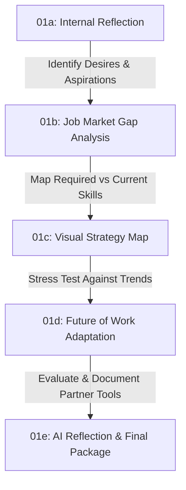

# Assignment 1: Career Strategy & Reflective Analysis Master Overview

**Course:** MTEC 4502 – Career and Portfolio Seminar  
**Instructor:** Dr. David B. Smith  
**Department of Entertainment Technology**  
**New York City College of Technology, CUNY**

---

## Overview & Purpose

Assignment 1 forms the foundational career-planning phase of MTEC 4502 (worth **20% of your total course grade**). Rather than treating career planning as a static resume exercise, this 5-week scaffolded assignment guides you from **internal self-reflection** to **job-market gap analysis**, **visual modeling**, **future-of-work stress testing**, and **collaborative AI reflection**.

The work you produce here serves as the core narrative and content for your final professional portfolio.

Before beginning Assignment 1a, complete [Assignment 00: Course Workspace and Research Setup](00_Course_Workspace_and_Research_Setup.md).

---

## Mandatory Citation & Research Policy (Zotero)

**Every external source used in this course—whether job listings, industry reports, articles, salary databases, software documentations, or market studies—MUST be documented in Zotero.**

* **The Baseline Exception (01a):** Part 01a relies *exclusively* on your unassisted internal reflection. No external research or AI tools are permitted for 01a.
* **Research Requirement (01b through 06):** Starting in Part 01b (Job Market Analysis) and continuing through your final portfolio and budgeting deliverables, **any source outside your own brain must be saved and cited using Zotero**.
* **Setup Required:** All students must install [Zotero Desktop](https://www.zotero.org/) and the **Zotero Connector** browser plugin, and join our [Shared Course Zotero Library](https://www.zotero.org/groups/6416274/mtec/library).

---

## Assignment Structure & Weekly Milestones

Assignment 1 is broken down into five distinct, sequential components:

| Part | Title & Deliverable | Syllabus Timeline | Core Focus |
| :--- | :--- | :---: | :--- |
| **[01a](01a_Reflective_Essay_Draft.md)** | **Reflective Essay Draft** | **Week 2** | Pure internal self-reflection (no outside research or AI). 750–1000 words. |
| **[01b](01b_Strategic_Framework.md)** | **Strategic Framework & Gap Analysis** | **Week 3** | Job-market research (3–5 listings), skills-gap analysis, and 1–3 year goal setting. |
| **[01c](01c_Integrating_Visualization.md)** | **Integrating Visualization** | **Week 4** | Platform comparison (MindMeister, Lucidchart, Trello, etc.) and visual outline draft. |
| **[01d](01d_Future_Modeling_and_Adaptive_Planning.md)** | **Future Modeling & Adaptive Planning** | **Week 5** | Future of Work stress test (MIT, WEF, NYT readings), Zotero research, & revised visual map. |
| **[01e](01e_AI_Analysis_and_Reflection.md)** | **AI Collaboration Reflection** | **Week 5** | Documentation of AI tools used, prompt log, limitations, and ethical evaluation. |

---

## How the Components Connect

1. **Step 1 (01a):** Establish your personal voice and goals based exclusively on your internal reflection (Due Week 2).
2. **Step 2 (01b):** Test your desires against real-world job postings to identify exact skill and competency gaps (Due Week 3).
3. **Step 3 (01c):** Transform your written strategy into an initial visual diagram or roadmap (Due Week 4).
4. **Step 4 (01d):** Stress-test your roadmap against macro industry trends and technological shifts (Due Week 5).
5. **Step 5 (01e):** Review how AI assisted (or challenged) your process and document your methodology (Due Week 5).

---

## Target Deliverables & Final Package

By **Week 5**, you will compile your work into a unified PDF/Google Doc submission containing:

1. **Final Reflective Essay & Strategic Framework Document** (incorporating revisions from Parts 1a & 1b).
2. **Visual Career Strategy Artifact** (embedded image or shareable link from Parts 1c & 1d).
3. **Annotated Future-of-Work Sources** (added to shared course Zotero library).
4. **AI Process Log & Critical Reflection Report** (Part 1e).

---

## Resources & Links

* [Emerging Media Technology Careers Guide](../resources/emerging_media_careers.md)
* [Speculative Future Careers Guide](../resources/speculative_future_careers.md)
* [Living Job Taxonomy](../resources/Living%20Job%20Taxonomy.md)
* [City Tech Professional Development Center](https://www.citytech.cuny.edu/pdc/)
* [Entertainment Technology Job & Internship Board](https://openlab.citytech.cuny.edu/groups/entertainment-technology-student-resources/docs/entertainment-technology-jobs-and-internships/)
* [National Career Development Association](https://www.ncda.org/)
* [Shared Course Zotero Library](https://www.zotero.org/groups/6416274/mtec/library)
